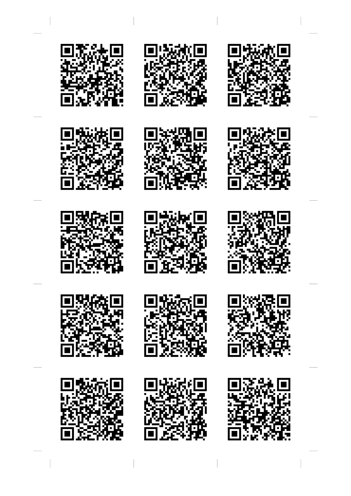
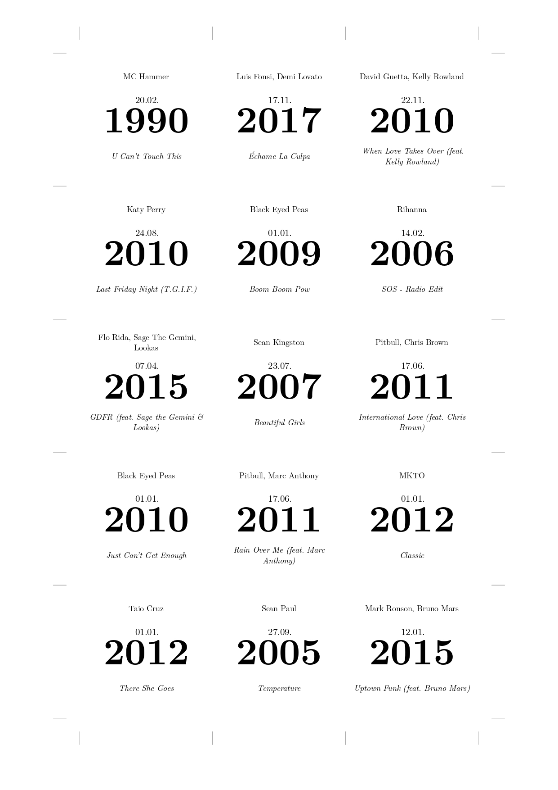

# Hitster Card Generator

This project generates printable [Hitster](https://hitstergame.com) cards from a Spotify playlist. It retrieves song information from Spotify, generates QR codes linking to the songs, and creates a duplex printable PDF with cards using Typst.

| Page Front | Page Back |
| ------------- | ------------- |
|  |   |

## Features

-   Spotify Integration: Fetches song details directly from a Spotify playlist.
-   QR Code Generation: Creates QR codes for each song, linking to its Spotify URL.
-   Printable Cards: Generates a PDF with formatted cards, ready for printing.
-   Configurable Layout: Allows customization of card size and page layout.

## Prerequisites

-   Python 3.9+
-   Poetry (for dependency management)
-   Spotify Developer Account (to obtain client credentials)

## Setup

1.  Clone the repository:
2.  Install dependencies using Poetry:

    `poetry install` 
 
3.  Set up Spotify API credentials:

    -   Create a Spotify Developer account and create an app to get your `CLIENT_ID` and `CLIENT_SECRET`.
    -   Set the following environment variables:

        ```bash
        export CLIENT_ID="your_client_id"
        export CLIENT_SECRET="your_client_secret"
        export PLAYLIST_ID="your_playlist_id"
        ```
        
## Usage

1.  Run the `main.py` script:

    `poetry run python main.py`

2.  Print the `hitster.pdf` file:

    -   Open the `hitster.pdf` file and print it.
    -   Cut along the provided markings to create the Hitster cards.

## Customization

-   Card Layout: Modify the `hitster.typ` file to customize the card layout, size, and appearance.
-   Spotify Playlist: Change the `PLAYLIST_ID` environment variable to use a different Spotify playlist.
-   Card Dimensions: Change the `card_size`, `rows`, and `cols` variables in `hitster.typ` to adjust the card dimensions and page layout.
-   Marking size: change the `marking_padding` to adjust the space for cutting.
